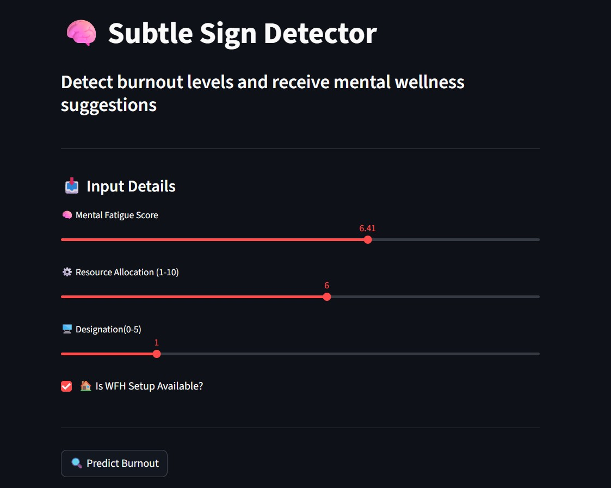
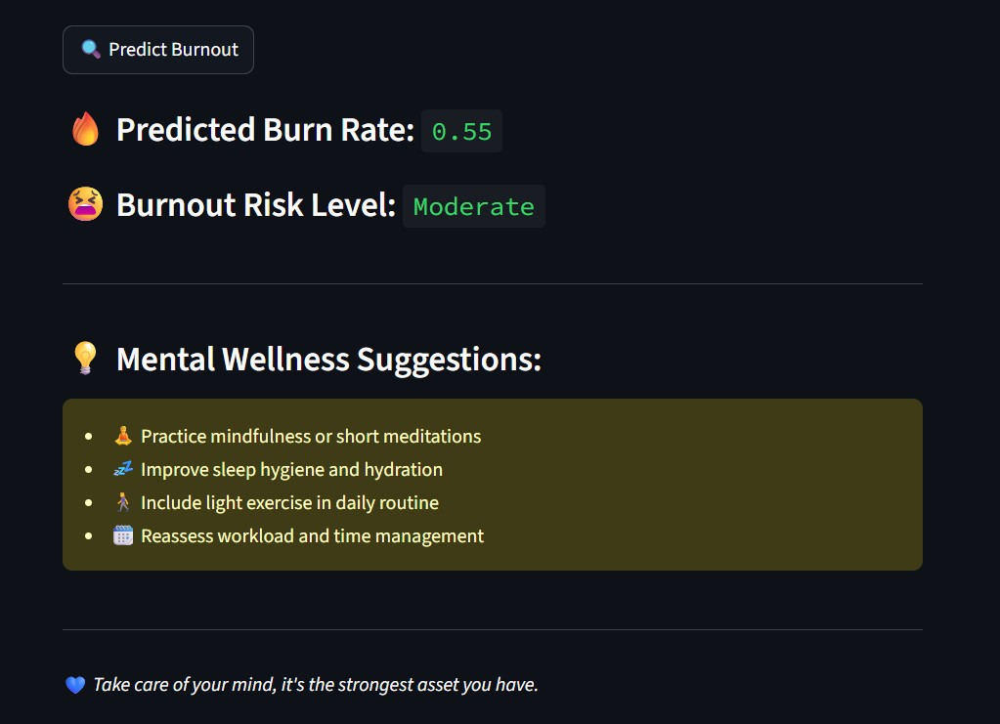

# Subtle Sign Detector 🧠💻

Web App for Employee Burnout Risk Analysis Using Machine Learning

## Table of Contents
- [Project Description](#project-description)
- [Features](#features)
- [Problem and Solution](#problem-and-solution)
- [Input Parameters](#input-parameters)
- [Output](#output)
- [App Preview](#app-preview)
- [Technologies & Tools](#technologies--tools)
- [Installation & Usage](#installation--usage)

## Project Description
Employee burnout is a critical challenge impacting productivity and wellbeing. The Subtle Sign Detector is a machine learning-powered web application that predicts early signs of burnout from subtle workplace behavior indicators.

The system predicts a burn rate and classifies burnout risk into Low, Moderate, or High, offering personalized wellness suggestions to promote proactive self-care.

## Features
- Predicts burn rate using a Random Forest Regressor
- Classifies burnout risk into Low, Moderate, High
- Provides personalized wellness recommendations
- Dark mode UI optimized for mental health usability
- Streamlit deployment for accessible web usage

## Problem and Solution
Burnout develops gradually and is difficult to detect early, often affecting employee performance and health.

This application provides a data-driven, accessible tool that:
- Helps individuals monitor burnout risk
- Enables HR teams to intervene preventively
- Supports overall workforce health and productivity

## Input Parameters

| Feature               | Description                                 |
|-----------------------|---------------------------------------------|
| Mental Fatigue Score  | Level of mental exhaustion (0–10)           |
| Resource Allocation   | Workload/resource load (1–10)               |
| Designation           | Employee’s role or seniority level          |
| WFH Setup Available   | 1 if work-from-home setup is available, 0 otherwise |

## Output

| Output Metric         | Description                                  |
|-----------------------|----------------------------------------------|
| Predicted Burn Rate   | Continuous value between 0.0 and 1.0         |
| Burnout Risk Level    | Categorized as Low, Moderate, or High        |
| Wellness Suggestions  | Tailored advice based on risk level          |

## App Preview

**Input Form**  

**Output Dashboard**  

## Technologies & Tools
- **Languages & Libraries:** Python 3.10, scikit-learn, Pandas, NumPy, Matplotlib, Seaborn
- **Deployment & Hosting:** Streamlit, Joblib, Google Colab

## Installation & Usage

A live demo of the app is available here:  
[Try the App on Streamlit](https://subtle-sign-detector-ka9g5apjnjvkmvufuy8jow.streamlit.app/)

