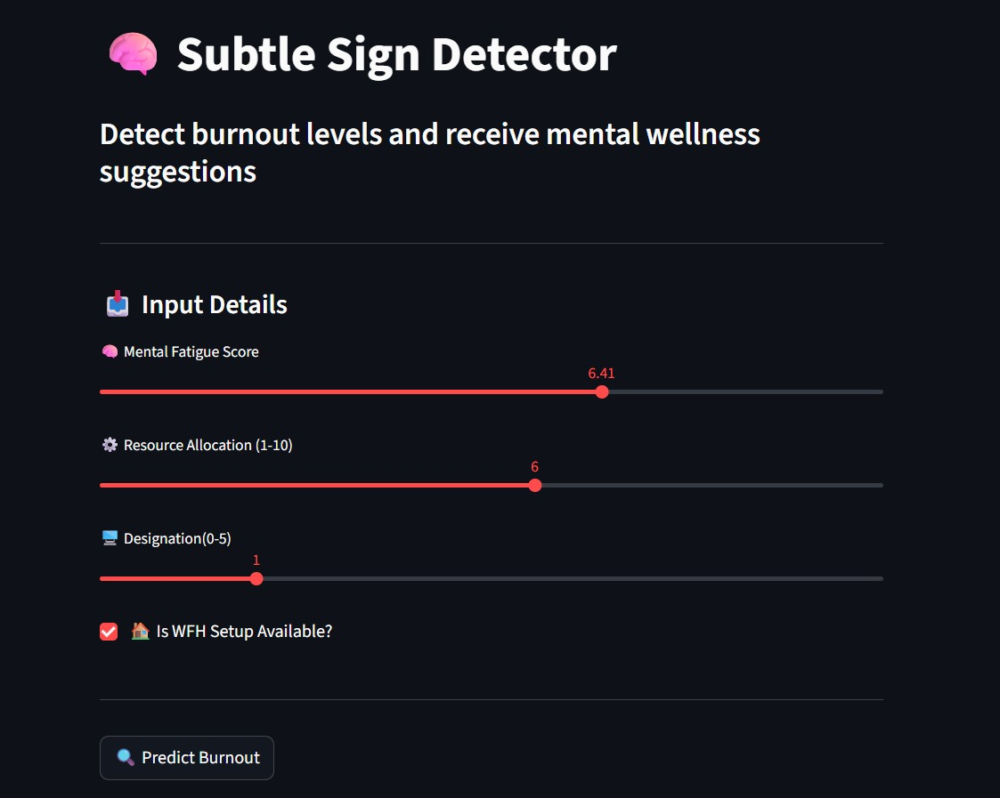
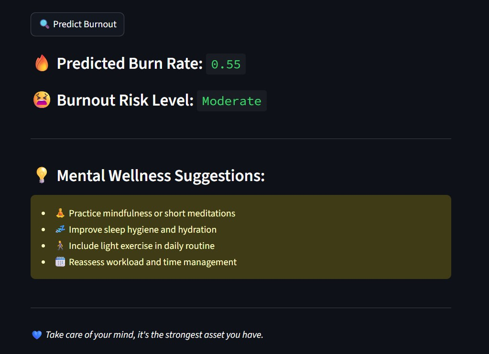

# Subtle Sign Detector 🧠💻

Web application for early detection of employee burnout risk using machine learning.

## Table of Contents
- [Overview](#overview)
- [Data Source](#data-source)
- [Objectives](#objective)
- [Methodology](#methodology)
- [Application Preview](#application-preview)
- [Technologies & Tools](#technologies)
- [Project Structure](#project-structure)
- [Installation & Usage](#installation--usage)

## Overview
Employee burnout is a gradual process that can significantly impact productivity, engagement, and mental health if not identified early.
The Subtle Sign Detector is a machine learning-powered web application that estimates burnout risk from subtle workplace indicators and provides supportive, non-clinical recommendations.

## Data Source
This project is built using the Employee Burnout Dataset containing anonymized employee-level features related to workload, fatigue, and work environment.
The dataset is publicly available on Kaggle : [Employee Burnout Dataset](https://www.kaggle.com/datasets/keshabkkumar/employee-burnout-dataset)

## Objective
* Estimate a continuous burn rate score for an individual based on key workplace and mental fatigue indicators.
* Classify burnout risk into interpretable categories: Low, Moderate, and High.
* Provide simple wellness-oriented suggestions to encourage proactive self-care and early awareness.

## Methodology
* **Target and features**
  * Target variable: burn rate (continuous value between 0 and 1).
  * Input features include mental fatigue, resource allocation, designation, and work-from-home setup availability.

* **Modeling**
  * Trained a Random Forest Regressor to predict burn rate from the selected features.
  * Applied standard preprocessing (handling missing values, encoding categorical features, and scaling where appropriate).

* **Risk categorization and recommendations**
  * Mapped the predicted burn rate into discrete risk levels (Low, Moderate, High) using threshold-based rules.
  * Defined a small set of wellness suggestions tailored to each risk level for interpretability and practical use.

## Application Preview

**Input Form** 
Illustrates the Streamlit interface where users specify mental fatigue, workload, designation, and WFH setup to obtain a burnout estimate.


**Output Dashboard**  
Displays the predicted burn rate, risk category, and corresponding wellness suggestions in a concise layout.


## Technologies
* **Language and libraries:** Python 3.10, scikit-learn, pandas, NumPy, Matplotlib, Seaborn
* **Model deployment:** Joblib, Streamlit
* **Development environment:** Google Colab

## Project Structure
```
subtle-sign-detectory
├── SubtleSignDetector_new.ipynb
├── app.py
├── app_inputs.jpg
├── app_ouputs.jpg
├── burnout_regressor.pkl
├── requirements.txt
├── risk_label_encoder .pkl
```

## Installation & Usage

A live demo of the app is available here:  
[Try the App on Streamlit](https://subtle-sign-detector-ka9g5apjnjvkmvufuy8jow.streamlit.app/)

To run the app locally :

1. Clone the repo
   ```bash
   git clone https://github.com/Shreiya-Muthuvelan/subtle-sign-detector 
   cd subtle-sign-detector
2. Install required libraries
   ```bash
   pip install -r requirements.txt
3. Run Streamlit app
   ```bash
   python app.py
   
